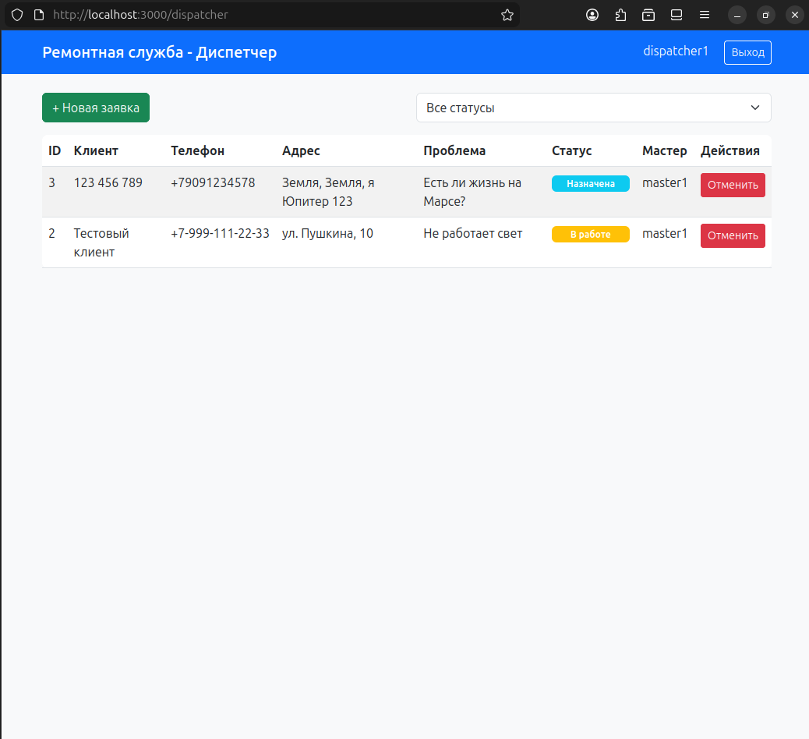
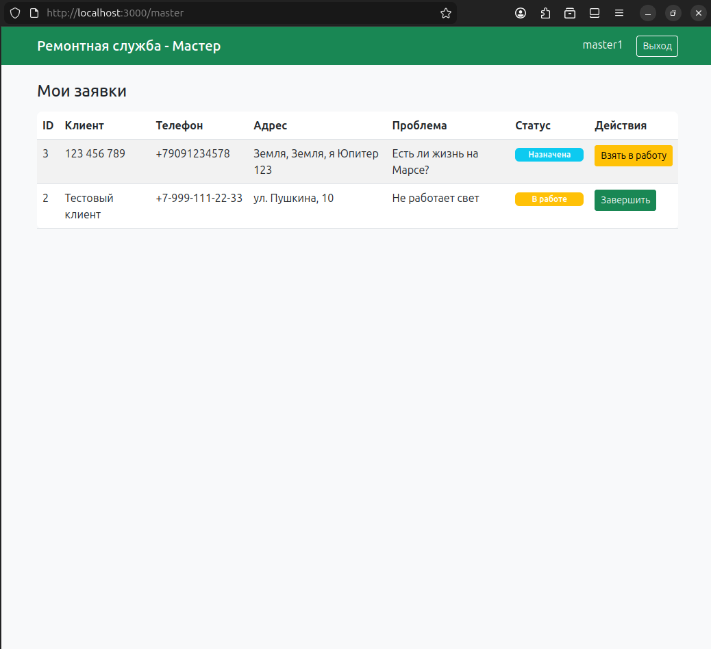

# Веб-сервис "Заявки в ремонтную службу"

Веб-приложение для приёма и обработки заявок в ремонтную службу.

## Функционал

- **Роли**: Диспетчер и Мастер
- **Заявки**: создание, назначение, взятие в работу, завершение, отмена
- **Статусы заявок**: `new`, `assigned`, `in_progress`, `done`, `canceled`
- **Защита от гонок**: optimistic locking с проверкой версии

## Быстрый старт

### Вариант A: Docker Compose (рекомендуется)

```bash
docker compose up --build
```

Приложение доступно по адресу: http://localhost:3000

### Вариант B: Локальный запуск (Node.js)

```bash
# Установка зависимостей
npm install

# Запуск
npm start
```

Приложение доступно по адресу: http://localhost:3000

## Тестовые пользователи

| Имя | Роль | Описание |
|-----|------|----------|
| `dispatcher1` | Диспетчер | Может назначать мастеров, отменять заявки |
| `master1` | Мастер | Может брать заявки в работу, завершать |
| `master2` | Мастер | Может брать заявки в работу, завершать |

## Страницы приложения

1. **Главная** (`/`) — Вход в систему
2. **Создание заявки** (`/create-request.html`) — Форма создания новой заявки
3. **Панель диспетчера** (`/dispatcher`) — Управление заявками
4. **Панель мастера** (`/master`) — Работа с назначенными заявками

## API

### Авторизация
- `POST /api/auth/login` — Вход (body: `{ name: "username" }`)
- `POST /api/auth/logout` — Выход
- `GET /api/auth/me` — Текущий пользователь
- `GET /api/auth/users` — Все пользователи
- `GET /api/auth/masters` — Все мастера

### Заявки
- `GET /api/requests` — Список заявок (опционально `?status=new`)
- `GET /api/requests/:id` — Заявка по ID
- `POST /api/requests` — Создать заявку
- `POST /api/requests/:id/assign` — Назначить мастера (диспетчер)
- `POST /api/requests/:id/cancel` — Отменить заявку (диспетчер)
- `POST /api/requests/:id/take` — Взять в работу (мастер, требуется `version`)
- `POST /api/requests/:id/complete` — Завершить заявку (мастер)
- `GET /api/requests/:id/events` — История изменений

## Проверка защиты от гонок

### Скрипт race_test.sh

```bash
# Запустите сервер в одном терминале
npm start

# В другом терминале запустите тест
./race_test.sh
```

### Вручную через curl

```bash
# 1. Логинимся и получаем cookie
curl -X POST http://localhost:3000/api/auth/login \
  -H "Content-Type: application/json" \
  -d '{"name": "master1"}' \
  -c cookies.txt

# 2. Находим заявку со статусом "assigned" и запоминаем ID и version
curl http://localhost:3000/api/requests -b cookies.txt

# 3. Запускаем два параллельных запроса (в разных терминалах)
# Терминал 1:
curl -X POST http://localhost:3000/api/requests/3/take \
  -H "Content-Type: application/json" \
  -d '{"version": 5}' \
  -b cookies.txt

# Терминал 2 (одновременно):
curl -X POST http://localhost:3000/api/requests/3/take \
  -H "Content-Type: application/json" \
  -d '{"version": 5}' \
  -b cookies.txt
```

**Ожидаемый результат**: Один запрос успешен (`status: "in_progress"`), второй возвращает `409 Conflict`.

## Тесты

```bash
npm test
```

## Структура проекта

```
base_bisnes/
├── src/
│   ├── controllers/     # Контроллеры
│   ├── services/        # Бизнес-логика
│   ├── repositories/    # Работа с БД
│   ├── middleware/      # Middleware (auth)
│   ├── routes/          # Маршруты
│   ├── db/              # БД (миграции, подключение)
│   └── app.js           # Express приложение
├── public/              # Frontend
│   ├── css/
│   ├── js/
│   └── *.html
├── migrations/          # SQL миграции
├── seeds/               # Сиды (тестовые данные)
├── tests/               # Автотесты
├── db/                  # SQLite база (создаётся автоматически)
├── docker-compose.yml
├── Dockerfile
├── README.md
├── DECISIONS.md         # Архитектурные решения
└── PROMPTS.md           # История запросов к AI
```

## Технологический стек

- **Backend**: Node.js + Express
- **База данных**: SQLite (better-sqlite3)
- **Frontend**: Vanilla JS + Bootstrap 5
- **Тесты**: Jest + Supertest
- **Контейнеризация**: Docker + Docker Compose

## Скриншоты

### Страница входа


### Панель диспетчера


### Панель мастера


## Автор

Создано в рамках тестового задания.
